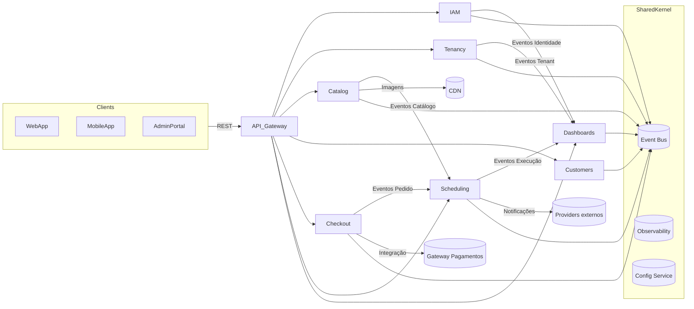

# Blueprint Arquitetural - Multiservice Marketplace (Spring Modulith)

## 1. Propósito e Escopo
Este documento define a visão arquitetural para a migração do backend atual (FastAPI) para o ecossistema **Spring Modulith** seguindo princípios de **Domain-Driven Design (DDD)** e **arquitetura hexagonal**. Ele padroniza as decisões sobre módulos, boundaries, fluxos e padrões técnicos que orientarão a evolução do sistema nos domínios de IAM, Tenancy, Catálogo, Clientes, Checkout, Agendamentos e Dashboard.

## 2. Visão Geral do Sistema
- **Estilo arquitetural:** Spring Modulith + arquitetura hexagonal.
- **Granularidade:** módulos alinhados a bounded contexts.
- **Integrações:** REST síncrono entre módulos, eventos assíncronos (Spring Application Events / mensageria futura), schedulers e integrações externas (pagamentos, notificações, analytics).
- **Requisitos não funcionais:** escalabilidade horizontal, deploy automatizado, observabilidade centralizada, versionamento de APIs, segurança Zero Trust e multi-tenancy.

## 3. Módulos e Bounded Contexts
| Módulo | Responsabilidade Principal | Bounded Contexts Relacionados |
| --- | --- | --- |
| **Identity & Access (IAM)** | Autenticação, autorização, gestão de credenciais, MFA, políticas de acesso por tenant. | IAM |
| **Tenancy Management** | Provisionamento de tenants, planos, limites, isolamento lógico e billing básico. | Tenancy |
| **Customer Profiles** | Cadastro de clientes finais, preferências, endereços, meios de contato. | Clientes |
| **Service Providers Catalog** | Gestão de prestadores, serviços ofertados, preços, disponibilidade, tags e reviews. | Catálogo |
| **Checkout & Payments** | Orquestração do carrinho, cálculo de preços, integração com gateways de pagamento, emissão de pedidos. | Checkout |
| **Scheduling & Fulfillment** | Agendamento de serviços, matching de prestadores, confirmação, reescalonamento e execução. | Agendamentos |
| **Dashboards & Reporting** | KPIs operacionais/financeiros, relatórios agregados por tenant e alertas. | Dashboard |
| **Shared Kernel / Platform** | Elementos cross-cutting: eventos comuns, logging, mensageria, observabilidade, integrações genéricas. | Kernel compartilhado |

## 4. Boundaries e Responsabilidades
### 4.1 Identity & Access
- Boundary exposto via APIs REST e eventos de identidade.
- Mantém agregados `UserAccount`, `Role`, `PermissionPolicy`.
- Ports outbound: diretórios de usuários externos (LDAP/OIDC), serviço de email/SMS para MFA.

### 4.2 Tenancy Management
- Controla ciclo de vida do `Tenant` e `Subscription`.
- Define contratos para limites de recursos, políticas de isolamento e faturamento.
- Ports outbound: billing externo, storage de metadados (por tenant), provisionamento infra.

### 4.3 Customer Profiles
- Responsável por `Customer`, `Address`, `Preference`.
- Notifica outros módulos sobre alterações relevantes (ex.: atualização de dados de contato).
- Ports outbound: serviços de marketing/comunicação, validação de endereço.

### 4.4 Service Providers Catalog
- Mantém `Provider`, `ServiceOffering`, `AvailabilitySlot`, `Review`.
- Expõe catálogos filtráveis e disponibiliza eventos de atualização para agendamentos e checkout.
- Ports outbound: motores de busca, CDN de imagens, sistemas de reputação.

### 4.5 Checkout & Payments
- Agregados `Cart`, `Order`, `PaymentIntent`.
- Coordena cálculo de preços, cupons, impostos, split de pagamento por tenant.
- Ports outbound: gateways de pagamento, serviços antifraude, contabilidade.

### 4.6 Scheduling & Fulfillment
- Agregados `Booking`, `Assignment`, `FulfillmentTask`.
- Consome disponibilidade do catálogo e confirmações do checkout.
- Ports outbound: notificações (email/SMS/push), ferramentas externas de roteirização/logística.

### 4.7 Dashboards & Reporting
- Agregados `KpiSnapshot`, `ReportTemplate`.
- Consome eventos de todos os módulos para gerar métricas e dashboards multi-tenant.
- Ports outbound: data warehouse/BI, exportações CSV.

### 4.8 Shared Kernel / Platform
- Fornece abstrações de eventos, segurança, tracing, configuração e integrações compartilhadas.
- Deve permanecer enxuto; funcionalidades específicas residem nos módulos de domínio.

## 5. Diagrama Arquitetural Global

## 6. Ports e Adapters
### 6.1 Ports Inbound
| Módulo | Tipo | Descrição |
| --- | --- | --- |
| IAM | REST Controllers | Login, registro, gestão de roles, MFA. |
| IAM | Event Listener | Consome eventos de Tenancy (desativação de tenant). |
| Tenancy | REST Controllers | CRUD de tenants, planos, limites. |
| Tenancy | Scheduler | Rotinas de billing e expiração de trial. |
| Customer Profiles | REST Controllers | CRUD de clientes, endereços. |
| Catalog | REST Controllers | Gestão de catálogo e disponibilidade. |
| Checkout | REST Controllers | Carrinho, pedidos, pagamentos. |
| Checkout | Event Listener | Atualizações de catálogo/preços. |
| Scheduling | REST Controllers | Gestão de agendamentos. |
| Scheduling | Event Listener | Consome eventos de pedidos e disponibilidade. |
| Dashboards | REST Controllers | APIs de relatórios. |
| Dashboards | Event Listener | Consome eventos de todos os módulos. |

### 6.2 Ports Outbound
| Módulo | Port | Adapter previsto |
| --- | --- | --- |
| IAM | IdentityDirectoryPort | Adapter OIDC/LDAP/Keycloak. |
| IAM | NotificationPort | Adapter Email/SMS para MFA. |
| Tenancy | BillingPort | Integração com billing SaaS. |
| Tenancy | ProvisioningPort | Adapter infra multi-tenant (storage, config). |
| Customer Profiles | MarketingPort | Integrado a CRM/marketing externo. |
| Catalog | MediaStoragePort | Upload para CDN/storage. |
| Catalog | SearchIndexPort | Indexação em motor de busca. |
| Checkout | PaymentGatewayPort | Integração com PSPs. |
| Checkout | FraudDetectionPort | Serviço antifraude. |
| Scheduling | NotificationPort | Mensageria (email, SMS, push). |
| Scheduling | LogisticsPort | Integrações com roteirizadores. |
| Dashboards | DataWarehousePort | ETL para BI/analytics. |
| Shared Kernel | EventBusPort | Mensageria (RabbitMQ/Kafka). |

## 7. DDD: Agregados e Entidades
- **Agregados raiz** definidos por contexto (ex.: `Tenant`, `UserAccount`, `ServiceOffering`, `Order`, `Booking`).
- Cada agregado deve expor invariantes e comportamentos ricos; não compartilhar entidades entre módulos sem contrato explícito.
- **Domínio rico:** regras de negócio residem no domínio; application layer orquestra casos de uso.
- **Domain Events**: publicados via Spring Modulith para manter acoplamento baixo e suportar consistência eventual.
- **Value Objects**: representar atributos imutáveis (Documentos, Address, Money, ScheduleSlot).
- **Factories e políticas**: para cenários complexos (ex.: política de precificação por tenant no Checkout).

## 8. Arquitetura Hexagonal
### 8.1 Camada Domain
- Entidades, agregados, value objects, domain services e eventos.
- Independente de frameworks (apenas Java + Spring annotations mínimas, se necessário).

### 8.2 Camada Application
- Use cases (services) que coordenam operações do domínio.
- Orquestra fluxos com ports inbound/outbound.
- Implanta DTOs e mapeamentos para interface externa.

### 8.3 Camada Infrastructure
- Adapters para persistence (Spring Data), mensageria, integrações externas e APIs REST.
- Implementa os ports outbound, configurações, migrations e observabilidade.

### 8.4 Convenções
- Separação por módulos com `module-info.java` e `@ApplicationModule` (Spring Modulith).
- Não permitir dependências circulares; usar `@ApplicationModule` com `allowedDependencies`.
- Testes de arquitetura (`ApplicationModuleTest`) para garantir boundaries.

## 9. Validação com Requisitos
- **Funcionais:** cada módulo cobre requisitos de autenticação, multi-tenant, catálogo, checkout, agendamento e dashboards conforme domínios listados.
- **Não funcionais:** modularidade permite deploy e evolução independente; hexagonal + ports/adapters garante testabilidade e isolamento; event-driven facilita escalabilidade e consistência eventual; observabilidade compartilhada assegura monitoramento.
- **Próximos passos:** detalhar modelos de dados por módulo, definir contratos de eventos e iniciar prototipação incremental.

## 10. Referências
- Spring Modulith Reference Guide.
- Domain-Driven Design (Eric Evans).
- Ports & Adapters (Alistair Cockburn).
