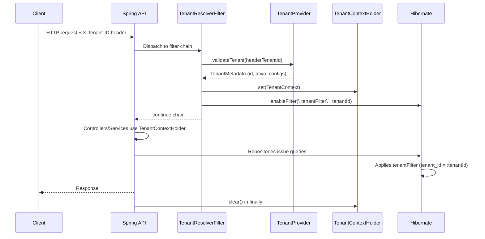

# Estratégia de Multi-Tenancy – Spring Boot 3 / Spring Modulith

## 1. Objetivos e Requisitos
- **Isolamento lógico total:** toda query JPA/Hibernate deve aplicar `tenant_id`.
- **Compatibilidade com módulos Modulith:** IAM, Tenancy, Catálogo, Clientes, Checkout, Agendamentos e Dashboards compartilham o mesmo contrato de resolução.
- **Suporte ao padrão atual:** cabeçalho `X-Tenant-ID`, validação do tenant e contexto disponível em qualquer camada (application, domain, infra).
- **Segurança:** impedir spoofing de tenant, validar estado `ativo` e associação com o utilizador autenticado.

## 2. Comportamento Atual (FastAPI)
- Middleware lê `X-Tenant-ID` (ou valor padrão derivado do domínio) e consulta o `TenantContext`.
- `TenantContext` valida se o tenant existe, se está `ativo` e mantém metadados (timezone, moeda, configs).
- Cada modelo contém `tenant_id` (via `TenantScopedMixin`). Queries usam filtros automáticos e validações antes de persistir.

## 3. Componentes propostos no Spring Modulith
| Componente | Tipo | Responsabilidades principais |
| --- | --- | --- |
| `TenantContextHolder` | Utilitário (ThreadLocal) | Guardar `TenantContext` (id, slug, timezone, moeda, flags); expor `getTenantId()`, `get()`, `set()`, `clear()`. |
| `TenantResolverFilter` | `OncePerRequestFilter` | Extrai `X-Tenant-ID`, valida formato, delega a `TenantProvider`, popula o `TenantContextHolder` e ativa o filtro Hibernate antes da request chegar ao controller. |
| `TenantProvider` | Serviço (Tenancy módulo) | Consulta cache/DB para validar a existência do tenant, estado (`ativo`), timestamps e config. Pode reutilizar o agregado `Tenant`. |
| `TenantAwareAuthenticationValidator` | Componente IAM | Verifica se o utilizador autenticado pertence ao tenant informado. |
| `TenantScopedEntity` | `@MappedSuperclass` | Define coluna `tenant_id`, listeners `@PrePersist/@PreUpdate` para preencher automaticamente a partir do `TenantContextHolder`. Inclui `@Filter` para isolamento. |
| `TenantFilterEnabler` | Bean infra | Customiza `HibernatePropertiesCustomizer` para ativar/desativar o filtro `tenantFilter` em cada `EntityManager`. |
| `TenantContextExecutor` | Utilitário | Permite capturar/copiar contexto para execuções assíncronas (eventos, @Async, schedulers, testes). |

## 4. Fluxo de resolução do tenant


## 5. Estratégias avaliadas para isolamento JPA/Hibernate
| Estratégia | Prós | Contras | Conclusão |
| --- | --- | --- | --- |
| **Filtro Hibernate global (`@Filter`)** | Aplica automaticamente a todas as entidades anotadas; evita esquecer cláusulas; funciona em consultas JPQL/Criteria/Native (com limitações). | Requer cuidado com queries nativas personalizadas; exige ativar filtro por sessão. | **Escolhida**. Garante isolamento consistente sem duplicação em repositórios. |
| **Aplicação manual em repositórios (Specifications/`@Query`)** | Controle explícito; sem dependência de filtros Hibernate. | Alto risco de esquecimento, necessidade de replicar cláusula em todos os repositórios, manutenção difícil. | Rejeitada. Não atende requisitos de segurança. |
| **Schemas por tenant** | Isolamento máximo físico. | Complexidade operacional, incompatível com objetivo atual (tabela compartilhada por tenant). | Fora de escopo. |

## 6. Implementação proposta
### 6.1 `TenantContextHolder`
```java
public final class TenantContextHolder {
    private static final ThreadLocal<TenantContext> CTX = new InheritableThreadLocal<>();

    public static void set(TenantContext context) { CTX.set(context); }
    public static TenantContext get() { return Optional.ofNullable(CTX.get())...; }
    public static UUID requireTenantId() { return get().tenantId(); }
    public static void clear() { CTX.remove(); }
}
```
- `TenantContext` (record) contém `UUID tenantId`, `String slug`, `String timezone`, `String currency`, `boolean active`.
- `TenantContextExecutor#withTenant(TenantContext, Runnable/Supplier)` facilita propagação para @Async.

### 6.2 Filtro + Listener Hibernate
```java
@MappedSuperclass
@FilterDef(
    name = "tenantFilter",
    parameters = @ParamDef(name = "tenantId", type = UUIDCharType.class)
)
@Filter(name = "tenantFilter", condition = "tenant_id = :tenantId")
public abstract class TenantScopedEntity {
    @Column(name = "tenant_id", nullable = false)
    private UUID tenantId;

    @PrePersist
    @PreUpdate
    void assignTenant() {
        if (tenantId == null) {
            tenantId = TenantContextHolder.requireTenantId();
        } else if (!tenantId.equals(TenantContextHolder.requireTenantId())) {
            throw new TenantMismatchException(...);
        }
    }
}
```

`TenantFilterEnabler`:
```java
@Bean
HibernatePropertiesCustomizer tenantHibernateCustomizer(EntityManagerFactory emf) {
    return props -> props.put(EntityManagerFactoryBuilderCustomizer.BEAN_NAME,
        (EntityManagerFactoryBuilderCustomizer) builder -> builder.applyBeanManager(...));
}
```
Na prática, utilizaremos um `EntityManagerFactoryBuilderCustomizer` ou `JpaProperties` para registrar um `TenantFilterActivationBeanPostProcessor` que ativa o filtro em cada `Session`:
```java
entityManager.unwrap(Session.class)
             .enableFilter("tenantFilter")
             .setParameter("tenantId", TenantContextHolder.requireTenantId());
```

### 6.3 `TenantResolverFilter`
- Extende `OncePerRequestFilter`.
- Passos:
  1. Ler `X-Tenant-ID`. Rejeitar request sem header (HTTP 400) exceto rotas públicas (login, provisionamento) definidas numa whitelist.
  2. Resolver `Tenant` via `TenantProvider`. Verificar `ativo`, data de expiração, limites, etc.
  3. Validar associação com o utilizador autenticado (IAM). Se usuário não pertence ao tenant, retornar HTTP 403.
  4. Popular `TenantContextHolder` e ativar filtro Hibernate (`EntityManagerFactoryUtils.getTransactionalEntityManager` + enable filter).
  5. Invocar `filterChain.doFilter`.
  6. Limpar contexto em bloco `finally`.

### 6.4 Propagação para eventos e tarefas
- **Eventos Modulith:** `ApplicationEvent` deve carregar `TenantContext`. Criar interface `TenantAwareEvent` ou decorador que injeta o tenant atual antes de publicar.
- **@Async / Schedulers:** usar `TenantContextExecutor` ou `DelegatingSecurityContextAsyncTaskExecutor` customizado que também clona `TenantContext`.
- **Mensageria futura:** incluir `tenantId` no payload e redefinir `TenantContextHolder` no consumer.

## 7. Estratégia de testes
| Tipo de teste | Estratégia |
| --- | --- |
| Unit tests de serviços | Utilizar `TenantContextTestSupport.withTenant("tenant-id", () -> service.call())`. |
| Integração / MVC | Configurar `MockMvc` para enviar `X-Tenant-ID`; criar `@WithMockTenant` meta-annotation. |
| Repositórios | Testes `@DataJpaTest` ativam filtro manualmente em `@BeforeEach`: `entityManager.unwrap(Session.class).enableFilter(...);`. |
| End-to-end | Scripts de seed criam dados multi-tenant; suites executam cenários com e sem acesso autorizado. |

## 8. Segurança e validações
- **Whitelists controladas:** apenas endpoints específicos podem omitir o header (ex.: `/tenants/provision`). Nestes casos o filter injeta um tenant “system” ou executa lógica especial.
|-**Cross-tenant leakage prevention:** qualquer tentativa de forçar `tenant_id` diferente no payload dispara `TenantMismatchException`.
- **Logs e observabilidade:** adicionar `tenantId` ao MDC (Logback) e a métricas (Micrometer) para auditoria.
- **Cache multi-tenant:** componentes com cache (Catalog, Checkout) devem incluir `tenantId` na chave para evitar cross-pollination.

## 9. Compatibilidade com módulos
- **IAM:** `TenantAwareAuthenticationValidator` garante que tokens JWT carreguem `tenantId` ou que o utilizador esteja autorizado a usar o header informado.
- **Tenancy Management:** Provê `TenantProvider` (cache + fallback DB). Eventos de alteração de tenant invalidam o cache.
- **Catalog / Customers / Checkout / Scheduling:** todas as entidades estendem `TenantScopedEntity`, logo o filtro aplica-se automaticamente.
- **Dashboards:** queries agregadas multi-tenant usam endpoints administrativos com permissão explícita; nesses casos podem usar `TenantContextHolder` com um tenant especial ou desativar o filtro dentro de um bloco controlado (ex.: serviço de reporting com privilégios `SYSTEM`). Documentar exceções e proteger com `@Secured("ROLE_PLATFORM_ADMIN")`.

## 10. Próximos passos
1. Implementar `TenantContextHolder`, `TenantResolverFilter` e `TenantProvider` no módulo Tenancy compartilhado.
2. Adaptar entidades JPA para herdar `TenantScopedEntity` e remover duplicação de coluna.
3. Configurar `TenantFilterEnabler` e garantir cobertura de testes (unitário + integração) para habilitar/desabilitar filtros.
4. Revisar endpoints públicos para garantir comportamento correto quando o header não é enviado.
5. Atualizar guia de desenvolvimento para incluir o novo requisito de enviar `X-Tenant-ID` em chamadas locais.
